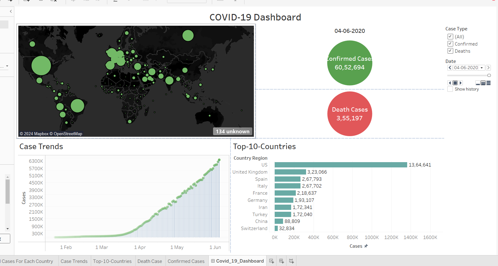

# COVID-19 Dashboard

This project provides an interactive COVID-19 Dashboard created using Tableau, visualizing global COVID-19 cases and trends. The dashboard includes key metrics like confirmed cases, death cases, and top-10 affected countries, with case trends displayed over time.




## Overview

The COVID-19 Dashboard visualizes:
- **Map of confirmed COVID-19 cases worldwide**: Bubble sizes represent the number of cases in each region.
- **Confirmed Cases and Death Cases**: A snapshot of confirmed and death cases globally as of the last update.
- **Case Trends**: A line chart showing the growth of confirmed cases over time.
- **Top-10 Countries by Cases**: A bar chart listing the countries with the highest case counts.

## Data Source

The dashboard uses data from the provided file `COVID-19.csv` convert it to `COVID-19.xlsx`, which contains COVID-19 statistics for various countries. This data includes information on confirmed cases, deaths, and trends over time.

## File Structure

- `Dashboard.png`: A screenshot of the Tableau COVID-19 Dashboard.
- `COVID-19.csv`: The dataset containing COVID-19 cases, deaths, and other relevant information.
- `README.md`: Documentation for setting up and running the dashboard.

## Requirements

- **Tableau Desktop**: You need Tableau to open, edit, and view the dashboard. Tableau Public (free version) can be used to view and publish dashboards online.
- **Concert CSV Data File To xlsx Format**: Ensure `COVID-19.xlsx` is available in the project directory for data import into Tableau.

## Setup Instructions

1. **Clone the repository**:
    ```bash
    git clone https://github.com/IshanSrivastav/Covid19_Dashboard_Tableau.git
    cd covid19-dashboard
    ```

2. **Open Tableau**:
   - Launch Tableau Desktop or Tableau Public.
   - **Open Dashboard:** Access the project on [Tableau Public](https://public.tableau.com/app/profile/ishan.srivastav4644/viz/Covid-19-Dashboard_17310662793620/Dashboard1?publish=yes) or use the local `.twbx` file.

3. **Import Data**:
   - Connect to the `COVID-19.csv` file within Tableau.

4. **Build the Dashboard**:
   - Use the following sheets to recreate the visuals:
     - **Map Visualization**: Display confirmed cases on a world map with bubble sizes representing the number of cases.
     - **Case Trends**: Create a line chart to show the progression of COVID-19 cases over time.
     - **Top-10 Countries**: Generate a bar chart showing the countries with the highest confirmed cases.
     - **Confirmed and Death Cases**: Use KPI indicators for the total confirmed and death cases.

5. **Customize Filters**:
   - Add a date filter to explore data across different time periods.
   - Include filters for case type (confirmed or deaths).

## Usage

Once setup, you can interact with the dashboard:
- Use filters to view data for specific dates or case types.
- Hover over map bubbles to view case counts by region.
- Analyze trends and compare case growth between countries.

# Contributing

**Contributions are welcome! If you have ideas for enhancements or spot any issues, feel free to submit a pull request.**

